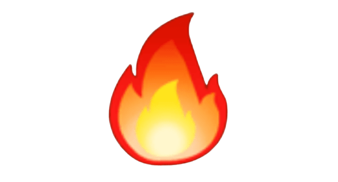
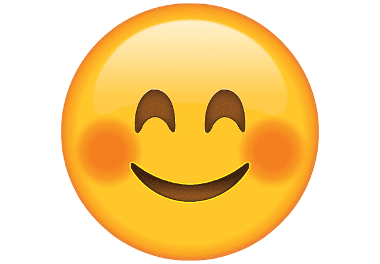

# O que é
Esse programa deixa o usuário escolher de uma selecao de 10 ótimos filtros e 5 belos stickers e alterar a sua foto de incontáveis maneiras. Após as alterações existe a possibilidade de salvar a nova foto editada.
# Como executar
Alguns imports são necessários para que o programa funcione, a seguir uma imagem com eles.\
\
Apenas altere o local onde a foto dos stickers está armazenada no seu computador nas linhas: **163, 165, 167, 169, 171**.\
Caso a câmera esteja dando erro ao abrir provavelmente será necessario mudar a linha **178** de (0) para (1) ou algo parecido.\
Após realizar essas mudanças apenas execute o arquivo e seja feliz!

# Como funciona
Ao executar o arquivo depois de ter feito as devidas modificações, ele irá perguntar se o usuário deseja utilizar uma foto ou a câmera dele.
#### Arquivo
- Case seja selecionado abrir uma foto, o usuário deve passar o caminho de onde essa foto esta localizada.\
Duas janelas serão abertas para o usuário, as janelas "**Controle**" e "**Imagem**".

# Janela Controle 
## Trackbar 
Existem duas trackbars na janela controle que são utilizadas para mudar o filtro e aplicar stickers.\
A "**Efeitos**" vai de 0 a 10, cada uma correspondendo a um filtro diferente disponivel.\
A "**Stickers**" vai de 0 a 5, cada uma selecionando um sticker diferente.

## Filtros
Abaixo estão exemplos de cada filtro com o nome e o numero da trackbar para aplicar o filtro.
### Greyscale (1)

### Brightness Adjustment (2)

### Sharp Effect (3)

### Sepia Filter (4)

### Pencil Sketch Effect: Greyscale (5)

### Pencil Sketch Effect: Colour (6)

### HDR effect (7)

### Invert Filter (8)

### Summer Effect Filter (9)

### Winter Effect Filter (10)

## Stickers
Os stickers disponiveis com o nome dele e o número da trackbar. Para aplicar um sticker ele deve estar selecionado e o usuário deve dar um double click esquerdo para determinar o ponto superior esquerdo do sticker.
### Fogo (1)

### Estrela (2)

### Bola (3)

### Arco-Iris (4)

### Feliz (5)

# Janela Imagem
Mostra a imagem ou o vídeo da camera com o filtro selecionado e os stickers colados, sera constantemente atualizada de acordo com os desejos do usuário.

# Salvar imagem e saida do programa
Para salvar, deve clicar duas vezes com o botao direito do mouse na imagem, isso resultara em uma nova imagem no diretório do programa com o nome sendo um numero aleatório entre 1 e 3000.\
Para sair do programa a tecla '**q**' deve ser pressionada.